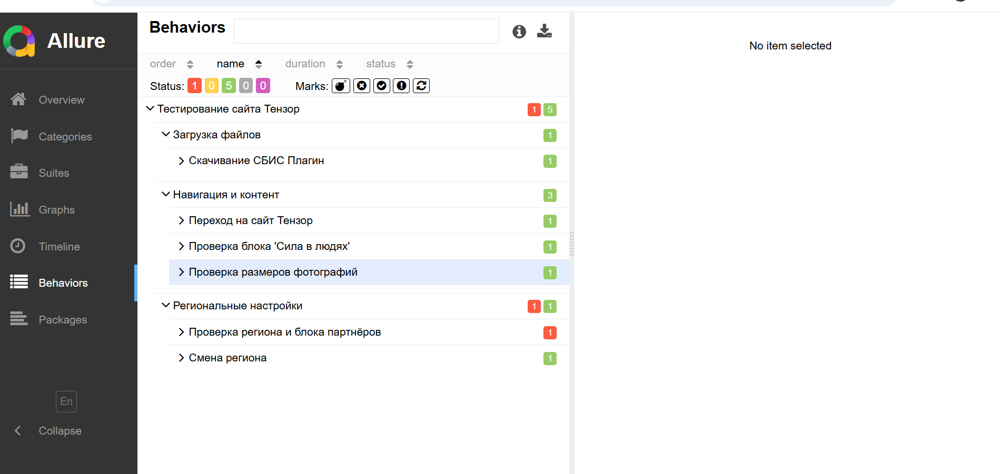

# Тестовое задание на вакансию программист-тестировщик от компании ТЕНЗОР

---

## Описание

Этот проект — автотесты для проверки ключевых сценариев сайта [sbis.ru](https://sbis.ru/) и связанных сервисов.  
Тесты реализованы с использованием **Python 3**, **Selenium WebDriver**, **pytest** и интеграцией с **Allure** для красивых отчётов. Применён паттерн **PageObject**.

---

## Оригинальное задание от компании

> **Правила выполнения задания:**  
> 1) Необходимо автоматизировать проверки двух обязательных сценариев.  
> 2) Третий сценарий выполнять не обязательно, но это будет дополнительным плюсом на техническом собеседовании.  
> 3) Автотесты реализованы на Python 3 и Selenium Webdriver  
> 4) В качестве тестового framework используется pytest  
> 5) Реализован паттерн PageObject  
> 6) Приветствуются любые сторонние библиотеки для логирования, отчетов, selenium wrapper  
> 7) Готовый проект залит на github/gitlab без кешей, драйверов и виртуальных окружений. С открытым доступом на чтение.  
>
> **Первый сценарий:**  
> 1) Перейти на https://sbis.ru/ в раздел "Контакты"  
> 2) Найти баннер Тензор, кликнуть по нему  
> 3) Перейти в этом блоке в "Подробнее" и убедиться, что открывается https://tensor.ru/about  
> 4) Находим раздел Работаем и проверяем, что у всех фотографии хронологии одинаковые высота (height) и ширина (width)  
>
> **Второй сценарий:**  
> 1) Перейти на https://sbis.ru/ в раздел "Контакты"  
> 2) Проверить, что определился ваш регион (в нашем примере Ярославская обл.) и есть список партнеров.  
> 3) Изменить регион на Камчатский край  
> 4) Проверить, что подставился выбранный регион, список партнеров изменился, url и title содержат информацию выбранного региона  
>
> **Третий сценарий (необязательный):**  
> 1) Перейти на https://sbis.ru/  
> 2) В Footer'e найти и перейти "Скачать локальные версии"  
> 3) Скачать СБИС Плагин для вашей для windows, веб-установщик в папку с данным тестом  
> 4) Убедиться, что плагин скачался  
> 5) Сравнить размер скачанного файла в мегабайтах. Он должен совпадать с указанным на сайте (в примере 3.64 МБ).  
>
> Chrome webdriver 134.0.6998.35 https://googlechromelabs.github.io/chrome-for-testing/#stable  
> https://storage.googleapis.com/chrome-for-testing-public/134.0.6998.35/win64/chrome-win64.zip  
>
> Запуск как обычно, никаких дополнительных флагов не нужно (запуск pytest в директории файлов тест-кейсов )

---

## Структура проекта

```
.
├── pages_and_related_files/
│   ├── base_page.py         # Базовый класс PageObject
│   ├── main_page.py         # PageObject для главной страницы
│   ├── contact_page.py      # PageObject для страницы 'Контакты'
│   ├── tenzor_page.py       # PageObject для страницы Тензор
│   ├── about_page.py        # PageObject для страницы 'О компании'
│   ├── dowload_ver_page.py  # PageObject для страницы загрузки плагина
│   ├── locators.py          # Все локаторы проекта
│   └── __init__.py
├── test_tenzor_one.py       # Тест-кейсы для первого сценария
├── test_tenzor_two.py       # Тест-кейсы для второго сценария
├── test_tenzor_three.py     # Тест-кейсы для третьего сценария (дополнительно)
├── conftest.py              # Pytest fixtures (настройка браузера и окружения)
├── README.md                # Описание проекта
└── requirements.txt         # Зависимости проекта
```

---

## Allure

В проект интегрирован [Allure](https://docs.qameta.io/allure/) для информативных отчётов по автотестам.

**Как запустить тесты с Allure:**
```bash
pip install -r requirements.txt
pytest --alluredir=allure-results
allure serve allure-results
```

**Пример отчёта:**




---

## Запуск автотестов

1. Установите зависимости:
   ```bash
   pip install -r requirements.txt
   ```
2. Скачайте [Chrome WebDriver](https://googlechromelabs.github.io/chrome-for-testing/#stable) и убедитесь, что он доступен в PATH.
3. Запустите тесты командой:
   ```bash
   pytest --alluredir=allure-results
   allure serve allure-results
   ```
4. Результаты выполнения и отчёт появятся в браузере.

---

## CI/CD

В проекте реализована интеграция с GitHub Actions для автоматического запуска тестов.

---

